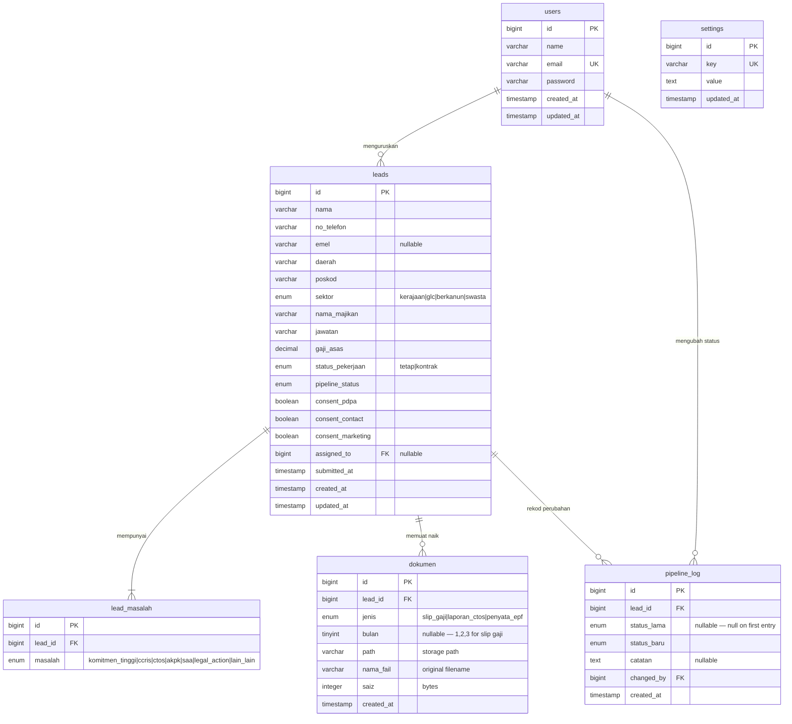

# RCMS — Entity Relationship Diagram

> **Render tip:** GitHub renders the Mermaid diagram below automatically.  
> VS Code users: install the *Mermaid Preview* extension (`bierner.markdown-mermaid`).  
> Or paste the code block at [mermaid.live](https://mermaid.live).

---

## Diagram



---

## Penjelasan Setiap Jadual

### 1. `users`
Akaun admin yang boleh log masuk ke dashboard.

| Lajur | Jenis | Catatan |
|---|---|---|
| id | bigint | Primary key, auto-increment |
| name | varchar(255) | Nama penuh admin |
| email | varchar(255) | Unique — untuk login |
| password | varchar(255) | Bcrypt hashed |
| created_at / updated_at | timestamp | Auto-managed by Laravel |

---

### 2. `leads`
Jadual utama — satu baris = satu permohonan yang dihantar melalui borang di landing page.

| Lajur | Jenis | Catatan |
|---|---|---|
| id | bigint | Primary key |
| nama | varchar(255) | Nama penuh pemohon |
| no_telefon | varchar(20) | Format: +601X-XXX XXXX |
| emel | varchar(255) | Nullable |
| daerah | varchar(100) | Contoh: Petaling Jaya |
| poskod | varchar(5) | |
| sektor | enum | `kerajaan`, `glc`, `berkanun`, `swasta` |
| nama_majikan | varchar(255) | |
| jawatan | varchar(255) | |
| gaji_asas | decimal(10,2) | Dalam Ringgit Malaysia |
| status_pekerjaan | enum | `tetap`, `kontrak` |
| pipeline_status | enum | Lihat senarai di bawah |
| consent_pdpa | boolean | Wajib disetujui |
| consent_contact | boolean | Wajib disetujui |
| consent_marketing | boolean | Optional |
| assigned_to | bigint (FK) | Nullable → `users.id` |
| submitted_at | timestamp | Masa borang dihantar |

**Nilai pipeline_status:**

| Nilai | Maksud |
|---|---|
| `new_lead` | Baru diterima |
| `dokumen_belum_lengkap` | Dokumen tidak lengkap |
| `dokumen_lengkap` | Semua dokumen ada |
| `dalam_semakan` | Sedang disemak oleh konsultan |
| `layak` | Dinilai layak untuk pembiayaan |
| `tidak_layak` | Tidak memenuhi syarat |
| `submit_bank` | Telah dihantar ke bank/koperasi |
| `approved` | Diluluskan oleh bank/koperasi |
| `rejected` | Ditolak oleh bank/koperasi |
| `disbursed` | Wang telah disalurkan |
| `closed` | Kes ditutup |
| `follow_up` | Perlu susulan semula |

---

### 3. `lead_masalah`
Satu lead boleh ada **banyak masalah** (checkbox berbilang di borang). Jadual ini simpan setiap masalah sebagai baris berasingan.

| Lajur | Jenis | Catatan |
|---|---|---|
| id | bigint | Primary key |
| lead_id | bigint (FK) | → `leads.id` |
| masalah | enum | `komitmen_tinggi`, `ccris`, `ctos`, `akpk`, `saa`, `legal_action`, `lain_lain` |

> **Alternatif:** Boleh guna satu lajur `masalah JSON` dalam jadual `leads` jika mahukan struktur lebih ringkas. Jadual berasingan lebih mudah untuk filter dan laporan.

---

### 4. `dokumen`
Fail yang dimuat naik oleh pemohon. Satu lead boleh ada beberapa dokumen.

| Lajur | Jenis | Catatan |
|---|---|---|
| id | bigint | Primary key |
| lead_id | bigint (FK) | → `leads.id` |
| jenis | enum | `slip_gaji`, `laporan_ctos`, `penyata_epf` |
| bulan | tinyint | Nullable — hanya untuk `slip_gaji` (nilai: 1, 2, atau 3) |
| path | varchar(500) | Path dalam Laravel storage |
| nama_fail | varchar(255) | Nama fail asal dari pemohon |
| saiz | integer | Saiz fail dalam bytes |
| created_at | timestamp | |

---

### 5. `pipeline_log`
Rekod **audit trail** — setiap kali status pipeline ditukar, satu baris baru dicipta. Berguna untuk tengok sejarah pergerakan setiap lead.

| Lajur | Jenis | Catatan |
|---|---|---|
| id | bigint | Primary key |
| lead_id | bigint (FK) | → `leads.id` |
| status_lama | enum | Nullable (null = pertama kali status ditetapkan) |
| status_baru | enum | Status selepas perubahan |
| catatan | text | Nullable — nota tambahan dari admin |
| changed_by | bigint (FK) | → `users.id` |
| created_at | timestamp | Masa perubahan berlaku |

---

### 6. `settings`
Simpan konfigurasi laman web yang boleh diedit dari panel admin (nombor WhatsApp, tajuk hero, info biodata, dsb.).

| Lajur | Jenis | Catatan |
|---|---|---|
| id | bigint | Primary key |
| key | varchar(100) | Unique — contoh: `whatsapp_number`, `hero_title` |
| value | text | Nilai berkenaan |
| updated_at | timestamp | |

**Contoh baris:**

| key | value |
|---|---|
| `whatsapp_number` | +60123456789 |
| `hero_title` | Semak Kelayakan Anda |
| `hero_cta` | Buat Semakan Awal Sekarang |
| `contact_email` | rahmahconsultant@gmail.com |
| `facebook_url` | https://facebook.com/... |

---

## Ringkasan Hubungan

```
users         → leads          (seorang admin boleh uruskan banyak lead)
users         → pipeline_log   (seorang admin boleh ubah status banyak kali)
leads         → lead_masalah   (satu lead ada 1 atau lebih masalah)
leads         → dokumen        (satu lead boleh ada beberapa dokumen)
leads         → pipeline_log   (satu lead ada rekod sejarah status)
```

---

## Nota Untuk Pembangunan

1. **Migrations** yang perlu dibuat:
   - `create_leads_table`
   - `create_lead_masalah_table`
   - `create_dokumen_table`
   - `create_pipeline_log_table`
   - `create_settings_table`
   - *(jadual `users` sudah wujud)*

2. **Models** yang perlu dibuat:
   - `Lead` (dengan relationships: `masalah()`, `dokumen()`, `pipelineLog()`, `assignedTo()`)
   - `LeadMasalah`
   - `Dokumen`
   - `PipelineLog`
   - `Setting`

3. **File storage:** Guna `storage/app/private/dokumen/{lead_id}/` supaya fail tidak boleh diakses terus dari URL awam.
