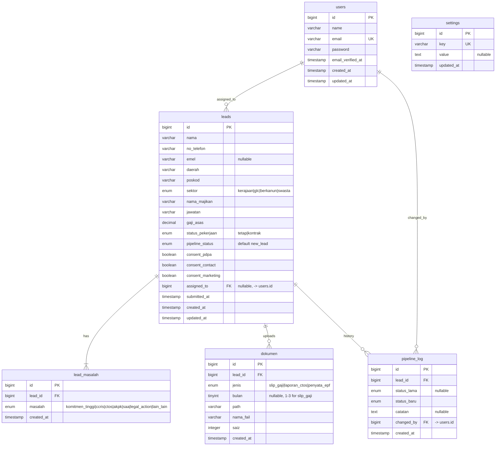

# RCMS — Backend Development Architecture Plan

> Status: **planning document only** — no code has been changed to produce this file. Nothing here is implemented yet unless explicitly noted as "already exists".

> ⚠️ **Scope for the current phase: NO authentication.** We build the database + public intake + admin data wiring *without any login/guard* for now, so `/admin/*` stays open during development. **Real authentication is deferred to the next phase** (see Phase 3 in [§7](#7-phased-delivery-plan)). The login UI already exists and stays in place — we just don't enforce it yet.

## 1. What "not fully" means

Right now the app is a static-data shell:

- The public landing page has a real lead-capture `<form>` ([landing.blade.php:581](resources/views/landing.blade.php#L581)) but it posts to `action="#"` — nothing receives it, nothing is saved.
- The admin pages (`dashboard`, `permohonan`, `laporan`, `landing`/settings) all render **hardcoded PHP arrays** from [AdminDashboardController.php](app/Http/Controllers/AdminDashboardController.php) — there is no `leads` table, no query, no persistence.
- Only the `users` table exists in the database. Every other table in [ERD.md](ERD.md) (`leads`, `lead_masalah`, `dokumen`, `pipeline_log`, `settings`) is documented but not migrated.
- Admin login UI exists but auth was deliberately reverted — there is no guard on `/admin/*`.

"Going fully backend" means closing all of these gaps end-to-end:

1. Migrations + Eloquent models for every table in the ERD.
2. The landing page form actually **creates** a `leads` row (+ `lead_masalah` rows + uploaded `dokumen` rows).
3. The admin `permohonan` page actually **reads** real leads, lets staff **update** pipeline status (writing a `pipeline_log` row each time), and view/download documents.
4. The admin `landing` (Tetapan Laman) page actually reads/writes the `settings` table, and the public landing page renders from `settings` instead of hardcoded copy.
5. Real authentication guarding `/admin/*`.
6. `laporan` and `dashboard` computed from real data instead of fixture arrays.

This is a multi-phase build — see [§7](#7-phased-delivery-plan).

---

## 2. Discrepancies to resolve BEFORE writing migrations

The existing views/controller disagree with each other and with ERD.md. Decide these first — they change the schema.

### 2a. `sektor` has three incompatible vocabularies

| Source | Values used |
|---|---|
| Landing form (the only place a value is actually *created*) — [landing.blade.php:627](resources/views/landing.blade.php#L627) | `kerajaan`, `glc`, `berkanun`, `swasta` |
| Laporan filter — [laporan.blade.php](resources/views/admin/laporan.blade.php) | `awam`, `swasta`, `sendiri`, `pesara` |
| Dashboard mock rows — [AdminDashboardController.php](app/Http/Controllers/AdminDashboardController.php) | `Awam`, `Pesara`, `Swasta` |

These don't reconcile: `awam/sendiri/pesara` can never be submitted by the form, and `kerajaan/glc/berkanun` can never be selected in the report filter.

**✅ DECIDED — one canonical set of 4 sectors: `kerajaan | glc | berkanun | swasta`.** This becomes the `leads.sektor` enum. Every other page must follow it:
- Rewrite the **laporan** sektor filter — drop `awam`, `sendiri`, `pesara`; use the 4 values above.
- Fix the **dashboard** mock (`Awam/Pesara/Swasta`) once it reads real data — those values disappear anyway.
- The **landing form** already uses these 4 correctly — no change needed there.

### 2b. Form field names ≠ intended DB column names

Some form field `name`s don't match the DB columns. **✅ DECIDED — rename the form fields to match the DB column names** (no translation layer in the controller; the form sends exactly what the column is called). Only 3 fields need renaming in [landing.blade.php](resources/views/landing.blade.php):

| Rename form field FROM | TO (= DB column) |
|---|---|
| `no_tele` | `no_telefon` |
| `alamat_emel` | `emel` |
| `sektor_pekerjaan` | `sektor` |

All other scalar fields (`nama`, `daerah`, `poskod`, `nama_majikan`, `jawatan`, `gaji_asas`, `status_pekerjaan`, `consent_marketing`) already match — leave them.

The file/multi-select inputs still fan out into child tables (this is normal, not a rename):

| Form field | Goes to |
|---|---|
| `masalah[]` | → `lead_masalah` rows (1 per checked value) |
| `slip_gaji[]` (3 files) | → `dokumen` rows (`jenis=slip_gaji`, `bulan`=1..3) |
| `ctos_report` (file) | → `dokumen` row (`jenis=laporan_ctos`) |
| `penyata_epf` (file) | → `dokumen` row (`jenis=penyata_epf`) |

### 2c. The mandatory consent checkboxes are never submitted

`modal-consent-pdpa` and `modal-consent-contact` ([landing.blade.php:793-800](resources/views/landing.blade.php#L793)) have **only an `id`, no `name`** — they gate submission client-side but are never sent to the server. Only `consent_marketing` is synced into the form via JS. Since `consent_pdpa`/`consent_contact` are the legally required PDPA consents, **✅ we will fix the form** (add hidden `consent_pdpa`/`consent_contact` inputs the way marketing is already handled, or give the checkboxes real `name`s), not just add columns — otherwise the DB records `false` for consents the user actually gave.

---

## 2d. Confirmed submission workflow

**Production flow:** user fills form → ticks the mandatory consents → clicks submit → all info + uploaded documents are saved to the database → user is **redirected to the Rahmah Consultancy WhatsApp** (number from the `settings` table) to continue the conversation, carrying their details with them.

**For now (testing scope):** build only up to *"saved to the database"*. After a successful save, show a **simple success notification** confirming the info and documents were uploaded. The WhatsApp redirect is deferred — leave a clear hook (`redirect()->away($whatsappUrl)`) where it will slot in later, but don't block on it. This lets us verify the intake actually persists before wiring the external hand-off.

---

## 3. Database ERD

This refines [ERD.md](ERD.md) against the fields the landing form ([landing.blade.php](resources/views/landing.blade.php)) and admin mock rows ([permohonan.blade.php](resources/views/admin/permohonan.blade.php)) already assume, so migrations can be written directly from it. `sektor` uses the landing-form vocabulary per the decision in [§2a](#2a-sektor-has-three-incompatible-vocabularies).



### Table reference (PK / FK at a glance)

| Table | PK | FK(s) | Notes |
|---|---|---|---|
| `users` | `id` | — | already exists; will gain `role` or rely on single-role admin for now |
| `leads` | `id` | `assigned_to` → `users.id` (nullable) | one row per public form submission |
| `lead_masalah` | `id` | `lead_id` → `leads.id` (cascade delete) | multi-select checkboxes, 1 row per selected value |
| `dokumen` | `id` | `lead_id` → `leads.id` (cascade delete) | uploaded files, stored outside `public/` |
| `pipeline_log` | `id` | `lead_id` → `leads.id`, `changed_by` → `users.id` | append-only audit trail, never updated/deleted |
| `settings` | `id` | — | key/value store, upsert by `key` |

---

## 4. Request → Controller → Model → View flow

```mermaid
flowchart TD
    subgraph Public["Public site (unauthenticated)"]
        L1["GET / (landing.blade.php)"] --> LC1["LandingController@show"]
        LC1 --> SM1["Setting model (read)"]
        F1["POST /leads (borang-permohonan)"] --> LeadC1["LeadController@store"]
        LeadC1 --> LM1["Lead model (create)"]
        LeadC1 --> LMM1["LeadMasalah model (createMany)"]
        LeadC1 --> DM1["Dokumen model (store files + createMany)"]
    end

    subgraph Auth["Auth"]
        AL["GET/POST /admin/login"] --> AC["AuthController@login"]
        AC --> UM["User model (Auth::attempt)"]
    end

    subgraph Admin["Admin panel (auth:web + admin middleware)"]
        D1["GET /admin/dashboard"] --> ADC["AdminDashboardController@index"]
        ADC --> LM2["Lead model (aggregates/counts)"]

        P1["GET /admin/permohonan"] --> PC["LeadController@index"]
        PC --> LM3["Lead model (paginate, filter, with() masalah/dokumen)"]
        P2["PATCH /admin/permohonan/{lead}"] --> PC2["LeadController@updateStatus"]
        PC2 --> LM4["Lead model (update pipeline_status)"]
        PC2 --> PLM["PipelineLog model (create audit row)"]

        R1["GET /admin/laporan"] --> RC["ReportController@index"]
        RC --> LM5["Lead model (groupBy sektor/status/date)"]

        S1["GET /admin/landing"] --> SC["SettingController@edit"]
        S2["POST /admin/landing"] --> SC2["SettingController@update"]
        SC2 --> SM2["Setting model (upsert per key)"]
    end

    LM1 -.-> Views1["views/admin/permohonan.blade.php"]
    SM1 -.-> Views2["views/landing.blade.php"]
    LM3 -.-> Views1
    LM5 -.-> Views3["views/admin/laporan.blade.php"]
    SM2 -.-> Views2
```



**Key relationships once built:**

| Layer | Component | Talks to |
|---|---|---|
| Route | `routes/web.php` | dispatches to Controllers |
| Controller | `LeadController` | `Lead`, `LeadMasalah`, `Dokumen`, `PipelineLog` models; `StoreLeadRequest` / `UpdateLeadStatusRequest` form requests |
| Controller | `AdminDashboardController` | `Lead` model only (read aggregates) — stops owning `permohonan`/`laporan`/`landing`, which move to their own controllers |
| Controller | `SettingController` | `Setting` model |
| Controller | `AuthController` (or Breeze/Fortify) | `User` model |
| Model | `Lead` | `hasMany(LeadMasalah)`, `hasMany(Dokumen)`, `hasMany(PipelineLog)`, `belongsTo(User, 'assigned_to')` |
| Model | `PipelineLog` | `belongsTo(Lead)`, `belongsTo(User, 'changed_by')` |
| View | Blade templates | receive data only from Controllers, never query models directly |

---

## 5. CRUD surface (what "every CRUD function working" covers)

| Feature | Create | Read | Update | Delete |
|---|---|---|---|---|
| Leads (public submit) | ✅ landing form → `leads`+`lead_masalah`+`dokumen` | — | — | — |
| Leads (admin) | manual add (optional, low priority) | ✅ list + filter + detail view | ✅ pipeline status, `assigned_to` | soft delete only (never hard-delete PDPA data) |
| Documents | ✅ via lead submission | ✅ admin can view/download | — (re-upload = new row) | ✅ admin can remove a bad upload |
| Pipeline log | ✅ auto-created on every status change | ✅ shown as history timeline on lead detail | — (append-only) | — (never) |
| Settings | seeded defaults | ✅ admin settings page + public landing reads them | ✅ admin settings page | — |
| Users/admins | seeded/manual for now | ✅ (implicit via auth) | password reset (later) | — |

---

## 6. Best-practice structure for a scalable corporate site

Keep the current 4-layer split (routes → controllers → models → blade), but split responsibilities that are currently all crammed into `AdminDashboardController`:

```
app/
  Http/
    Controllers/
      LandingController.php        # public GET /
      Admin/
        DashboardController.php    # GET /admin/dashboard (aggregates only)
        LeadController.php         # GET/PATCH /admin/permohonan, lead detail
        ReportController.php       # GET /admin/laporan
        SettingController.php      # GET/POST /admin/landing (site settings)
      LeadSubmissionController.php # POST /leads (public form target)
      Auth/LoginController.php     # admin login (or swap in Laravel Breeze)
    Requests/
      StoreLeadRequest.php         # validates the full public form incl. files
      UpdateLeadStatusRequest.php
      UpdateSettingsRequest.php
    Middleware/
      EnsureUserIsAdmin.php        # or just Laravel's default `auth` guard if single-role
  Models/
    Lead.php
    LeadMasalah.php
    Dokumen.php
    PipelineLog.php
    Setting.php
    User.php                      # already exists
  Services/                       # only if lead-submission logic grows complex
    LeadIntakeService.php         # orchestrates: create lead + masalah + file storage, called from controller
database/
  migrations/                     # one per table above
  factories/                      # LeadFactory, DokumenFactory for tests/seeding
  seeders/
    SettingsSeeder.php            # seeds default whatsapp_number, hero_title, etc.
    DemoLeadsSeeder.php           # replaces today's hardcoded arrays for local dev
```

Practices to apply as this is built out:

- **Form Requests, not inline `$request->validate()`** — keeps controllers thin and validation rules reusable/testable.
- **Route-model binding** (`Route::patch('/admin/permohonan/{lead}', ...)`) instead of manual `Lead::find($id)`.
- **File storage**: uploaded documents go to a **private disk** (`storage/app/private/dokumen/{lead_id}/...`, per ERD.md's own note), served through a controller action that checks admin auth — never `public/storage`.
- **Enums as PHP backed enums** (`App\Enums\PipelineStatus`, `App\Enums\Sektor`) cast on the `Lead` model, instead of raw strings, so pipeline transitions are type-checked in one place.
- **Policies** (`LeadPolicy`) once there's more than one admin role, so "who can change status / delete a lead" isn't scattered across controllers.
- **Pest feature tests per flow**: submitting the landing form creates the right rows; changing pipeline status writes a `pipeline_log` row; unauthenticated users get redirected from `/admin/*`. Existing `tests/Feature/ExampleTest.php` / `tests/Unit/ExampleTest.php` should be replaced with real ones as each phase lands.
- **Seeders replace hardcoded arrays** — `DemoLeadsSeeder` gives local/dev the same look as today's mock data, but as real rows, so removing the fixtures from the controller is a net simplification, not a regression.
- **Settings caching**: `settings` is read on every public page load, so wrap `Setting::get($key)` in a cache remember (invalidated on admin save) rather than querying per-request.

---

## 7. Phased delivery plan

1. **Foundation** — migrations for `leads`, `lead_masalah`, `dokumen`, `pipeline_log`, `settings`; matching Eloquent models + relationships; `SettingsSeeder` with today's hardcoded copy as defaults.
2. **Public intake** — `StoreLeadRequest` (with the field→column mapping in [§2b](#2b-form-field-names--intended-db-column-names)), `LeadSubmissionController@store`, wire `borang-permohonan`'s `action="#"` to `POST /leads`, handle file uploads to private disk. **Also fix the form**: add `consent_pdpa`/`consent_contact` inputs so the mandatory PDPA consents actually submit ([§2c](#2c-the-mandatory-consent-checkboxes-are-never-submitted)). **Testing scope stops here** ([§2d](#2d-confirmed-submission-workflow)): on success, save everything to the DB and show a simple "info & documents uploaded" notification. Leave a `redirect()->away($whatsappUrl)` hook for the WhatsApp hand-off but defer it.
3. **Admin auth** — ⏭️ **NEXT PHASE, deferred (not in the current build).** Re-wire the existing login view to real `Auth::attempt` and guard `/admin/*` with `auth` middleware (un-reverts the earlier "Add admin login UI and auth wiring" commit, this time backed by real users). Until this phase lands, `/admin/*` is intentionally open and the login UI is display-only.
4. **Admin lead management** — `Admin\LeadController@index` (replacing `AdminDashboardController::permohonan`), filters, pipeline status update + `PipelineLog` write, document view/download.
5. **Settings management** — `Admin\SettingController`, wire the `Tetapan Laman` forms (currently `action="#"`) to persist into `settings`, and make the public landing page read from `settings` instead of hardcoded hero copy/socials.
6. **Reporting & dashboard** — replace fixture arrays in `AdminDashboardController::index`/`laporan` with real aggregate queries against `leads`/`pipeline_log`.
7. **Hardening** — Pest tests per flow, policies if multiple admin roles appear, rate-limiting the public submission route, PDPA-aware soft deletes.

### Included in THIS phase (feedback & confirmations)

Build the shared **notification + confirmation convention** from [§8](#8-notification--confirmation-convention) alongside Phases 1–2 & 4–5, so every write wired up in this build already gives feedback instead of being retrofitted later:

- One reusable flash-message partial rendered in both layouts (`layouts/main`, `layouts/admin`).
- Success notice after the public lead submission ([§2d](#2d-confirmed-submission-workflow)).
- Success notices after pipeline-status change and settings save, once those routes exist.
- Keep the existing delete confirm dialog, but make it a real delete (soft-delete) with a success notice — replace the current screen-only `confirm()` + row removal in [permohonan.blade.php:581](resources/views/admin/permohonan.blade.php#L581).

---

## 8. Notification & confirmation convention

Today these are placeholders: the delete button uses a browser `confirm()` that only removes the row visually and never hits a server ([permohonan.blade.php:584](resources/views/admin/permohonan.blade.php#L584)), print uses `alert(...)`, and no write shows a success message. Standardise on **one pattern** so every CRUD action behaves the same.

**Rule: confirm *before* destructive/irreversible actions; notify *after* every successful write.**

| Action | Confirm before? | Notify after (flash message) |
|---|---|---|
| Submit lead (public) | already gated by consent modal | ✅ `Maklumat & dokumen berjaya dihantar` |
| Change pipeline status | no (low risk; audit-logged in `pipeline_log`) | ✅ `Status permohonan dikemaskini` |
| Save settings (Tetapan Laman) | no | ✅ `Tetapan berjaya disimpan` |
| Delete lead | ✅ **yes** — keep the confirm dialog | ✅ `Rekod telah dipadam` |
| Delete a document | ✅ **yes** — confirm | ✅ `Dokumen dipadam` |

**How to implement (keep it simple, no extra libraries):**

- **Notify after**: use Laravel's session flash — controller does `return redirect(...)->with('success', '...')` (or `'error'`). Render it once in a shared partial (e.g. `resources/views/partials/flash.blade.php`) included in both `layouts/main.blade.php` and `layouts/admin.blade.php`, styled as a dismissible toast/banner. This means any current or future controller gets notifications for free just by flashing a message.
- **Confirm before**: keep native `confirm()` for now (it's already there and dependency-free) but the button must trigger a **real** `DELETE` request (a small `<form method="POST">` + `@method('DELETE')` + `@csrf`, submitted after confirm), not a client-side row removal. Soft-delete on the server per [§6](#6-best-practice-structure-for-a-scalable-corporate-site) so PDPA data isn't hard-erased.
- Destructive confirms should name the record and state it's irreversible (the existing copy — *"Padam rekod {nama}? Tindakan ini tidak boleh dibatalkan."* — is the right tone; keep it).

---

## 9. Development checklist (per phase)

Tick items as they land. Each phase should end green (migrate runs clean + the flow works in the browser) before starting the next.

### ✅ Phase 1 — Foundation (database + models) — DONE

Prerequisite decisions (all confirmed): 4 sectors [§2a], form-field renames [§2b], consent fix [§2c], no-auth scope [top banner].

**Migrations** (one file each, in dependency order):
- [x] `create_leads_table` — all columns from [§3](#3-database-erd); `sektor` enum = `kerajaan,glc,berkanun,swasta`; `pipeline_status` enum (12 values) default `new_lead`; `assigned_to` nullable FK → `users.id`; `consent_*` booleans; `submitted_at`; add `softDeletes()` (PDPA).
- [x] `create_lead_masalah_table` — `lead_id` FK cascade, `masalah` enum (7 values).
- [x] `create_dokumen_table` — `lead_id` FK cascade, `jenis` enum (3 values), `bulan` nullable tinyint, `path`, `nama_fail`, `saiz`.
- [x] `create_pipeline_log_table` — `lead_id` FK, `status_lama` nullable, `status_baru`, `catatan` nullable, `changed_by` FK → `users.id`.
- [x] `create_settings_table` — `key` unique, `value` text nullable.
- [x] `php artisan migrate` runs clean on the `rcms` MySQL DB.

**Models + relationships** (`app/Models/`):
- [x] `Lead` — `hasMany(LeadMasalah)`, `hasMany(Dokumen)`, `hasMany(PipelineLog)`, `belongsTo(User,'assigned_to')`; `$fillable`; `$casts` for booleans + decimal + `submitted_at`; `use SoftDeletes`.
- [x] `LeadMasalah` — `belongsTo(Lead)`.
- [x] `Dokumen` — `belongsTo(Lead)`.
- [x] `PipelineLog` — `belongsTo(Lead)`, `belongsTo(User,'changed_by')`.
- [x] `Setting` — added `Setting::get($key, $default)` (cached) + `Setting::set()` helper.
- [ ] (optional, deferred) backed enums `App\Enums\Sektor`, `PipelineStatus`, etc. — using validated strings for now.

**Seeders / factories** (so later phases have data without the hardcoded arrays):
- [x] `SettingsSeeder` — seeds `whatsapp_number`, `hero_title`, `hero_cta`, `contact_email`, socials from today's hardcoded copy.
- [x] `LeadFactory` (+ `DokumenFactory`) and a `DemoLeadsSeeder` mirroring the current mock rows as real records (sektor mapped to the 4 canonical values).
- [x] `php artisan migrate:fresh --seed` produces a browsable dataset (5 leads, 8 masalah, 20 dokumen, 5 pipeline logs, 7 settings).

**Definition of done for Phase 1:** ✅ all tables exist, `Lead::with('masalah','dokumen','pipelineLog','assignedTo')->first()` works, casts + soft-deletes verified via tinker, seeders populate demo data. No UI wired yet.

### ✅ Phase 2 — Public intake — DONE
- [x] Rename 3 form fields in `landing.blade.php` → `no_telefon`, `emel`, `sektor` (name only; ids kept for JS) [§2b]. Added `old()` repopulation to all fields.
- [x] Add submitting `consent_pdpa` / `consent_contact` inputs — synced from the modal into hidden form inputs [§2c].
- [x] Point form `action="#"` → `POST /leads` via `route('leads.store')` (+ existing `@csrf`).
- [x] `StoreLeadRequest` — validates all fields, files (`pdf,jpg,jpeg,png`, max 5 MB), 3 slip gaji, EPF `required_if` swasta, `accepted` consents.
- [x] `LeadSubmissionController@store` — creates `Lead` + `lead_masalah` rows + stores files to **private disk** `storage/app/private/dokumen/{lead_id}/` + `dokumen` rows, in a DB transaction.
- [x] Success **flash notice** [§8] after save; deferred `redirect()->away($whatsappUrl)` hook left in place [§2d].
- [x] Verified end-to-end: 4 Pest feature tests (`tests/Feature/LeadSubmissionTest.php`) + landing renders 200 via HTTP kernel. Full suite green (6 passed).

### ⬜ Phase 3 — Admin auth  ⏭️ DEFERRED (next phase, not this build)
- [ ] Wire login view → `Auth::attempt`; guard `/admin/*` with `auth` middleware; seed an admin user.

### ✅ Phase 4 — Admin lead management — DONE

> **No-auth decision:** since Phase 3 (auth) is deferred, `pipeline_log.changed_by` is attributed to the **seeded admin (first user)** for now, marked `// temp until Phase 3 auth`, swapping to the authenticated user in Phase 3. Document downloads stream from the private disk but are not auth-gated yet (same as the rest of open `/admin/*`).

- [x] `Admin\LeadController@index` reads real leads (paginate 15 + eager-load `masalah`/`dokumen`), replacing the mock arrays; `AdminDashboardController::permohonan` retired.
- [x] Filters (nama, tel, status, sektor) query the DB via a GET form; sektor uses the 4 canonical values [§2a]. Pipeline-status list centralised as `Lead::PIPELINE_STATUSES` / `Lead::SEKTOR` constants.
- [x] `updateStatus` route (`PATCH /admin/permohonan/{lead}`) via `UpdateLeadStatusRequest` + writes a `PipelineLog` row on every real change (skips + flashes error if unchanged) + success notice [§8].
- [x] Real soft-delete (`DELETE` form + `confirm()` dialog) + notice, replacing the screen-only delete [§8].
- [x] Document view/download via `Admin\DokumenController@download` streaming from the **private** disk (404 if missing); links rendered in the details modal. Not auth-gated yet (no-auth phase).
- [x] Verified: 8 Pest feature tests (`tests/Feature/AdminLeadManagementTest.php`) + permohonan renders 200 via HTTP kernel with seeded data (5 records, filter sektor=kerajaan → 2). Full suite green (14 passed).

### ✅ Phase 5 — Settings management — DONE (all 7 forms wired)

> **Scope note:** the `Tetapan Laman` page has 7 forms. Initially wired 3 (WhatsApp / Contact / Hero); a follow-up wired the remaining 4 — **Biodata, Services, Eligibility, Video** (incl. `bio_image`/`video_iklan` file uploads to the public disk). All settings seeded with the **exact current hardcoded copy**, and public reads use those exact strings as fallbacks, so the landing page is byte-identical until an admin edits it (verified via diff). **WhatsApp redirect stays deferred** per user (save + notice only). `SettingController@update` only flashes success when it actually persists something (no false success).

- [x] `Admin\SettingController@edit`/`@update`; the 3 forms post to `admin.landing.update`, persisted via `Setting::set()` (cache-busting). Partial update by key presence, so each form only writes its own fields. `UpdateSettingsRequest` validates email/URLs/strings. Success notice [§8]. `AdminDashboardController::landing` retired.
- [x] Public `landing.blade.php` hero (title/subtitle/CTA) + `partials/footer.blade.php` (contact email, WhatsApp number, Facebook/Instagram/TikTok links) read from `Setting::get()` (cached) instead of hardcoded values.
- [x] `SettingsSeeder` updated (added `hero_subtitle`, aligned `hero_title` to the headline's first line).
- [x] Verified: 5 Pest tests (`tests/Feature/SettingsManagementTest.php`) — save each form, partial-update isolation, email/URL validation, public page reflects saved values. Stock `ExampleTest` given `RefreshDatabase` (landing now needs the `settings` table). Full suite green (19 passed).

### ✅ Phase 6 — Reporting & dashboard — DONE
- [x] `AdminDashboardController::index` computes `stats` (jumlah/pending/approved/rejected), `recent` (6 latest leads, 12→3 status buckets), and `summary` (period counts + pipeline milestones) from real aggregate queries.
- [x] `Admin\ReportController@index` builds the laporan dataset (4 period buckets × total/sectors/pipeline/12-month trend) from the DB; monthly computed in PHP so it's cross-DB (sqlite tests). Route repointed; `AdminDashboardController::laporan` retired.
- [x] Laporan **sektor rewritten to the 4 canonical values** [§2a] — filter dropdown, summary cards (Awam→Kerajaan), and the JS `DATA`/`SECTORS` now use `kerajaan/glc/berkanun/swasta`; old `awam/sendiri/pesara` fully removed.
- [x] Verified: 5 Pest tests (`tests/Feature/DashboardReportTest.php`) + both pages render 200 via HTTP kernel with seeded data (dashboard jumlah=5; laporan `DATA` injected with canonical sectors). Full suite green (24 passed).

### ⬜ Phase 7 — Hardening
- [ ] Pest feature tests per flow; rate-limit `POST /leads`; policies if multiple admin roles appear.

### ✅ Phase 8 — UI/UX refinements (post-backend feedback batch) — DONE

Nine fixes raised after the backend build, validated with the user before implementing. Grouped by surface. Full suite green (**32 passed**) after the batch.

**Landing page — `resources/views/landing.blade.php`**
- [x] **"Lain-lain" (Others) free-text, persisted.** New nullable `lead_masalah.keterangan` column (migration `2026_07_08_000001_add_keterangan_to_lead_masalah_table`, max 100). A text box (`masalah_lain`, `maxlength=100` + live char counter) appears only when the "Lain-lain" checkbox is ticked (vanilla JS toggle, mirrors the EPF toggle). `StoreLeadRequest` validates it `required_if` lain_lain is selected; `LeadSubmissionController` writes the text onto the `lain_lain` row only. Surfaced back to admins in the Permohonan detail modal as `Lain-lain: <text>`. Covered by 2 new Pest tests.
- [x] **Document file-size warning.** Client-side `change` handler on every form file input warns inline and clears the field if a file exceeds 5 MB (mirrors the server `max:5120`).
- [x] **Consent pop-up warning fixed.** Reported bug: clicking submit in the consent modal without ticking the two mandatory boxes gave no feedback. `submitWithConsent()` now highlights each unticked box red (`.consent-missing`), shows a prominent banner (was a small inline `<p>`), and scrolls it into view; the highlight/banner clear as soon as both boxes are ticked. (Client-side only — the server already rejects missing consents via the `accepted` rule.)
- [x] **Statistics kept in sync.** The dark STATS section now reads the **same** `stat_2_val` / `stat_1_val` settings as the owner-profile stats and prints them verbatim (dropped the hardcoded count-up `data-target="10000"`/`"8"` that ignored the settings), so editing a stat in Tetapan Laman updates both sections together.

**Admin — Permohonan — `resources/views/admin/permohonan.blade.php` + `Admin\LeadController`**
- [x] **Merged search.** The separate `nama` + `tel` inputs became one `q` box; `LeadController@index` matches it against name **OR** normalized phone in a single grouped `where`.
- [x] **PDF button (UI only).** A PDF-styled `<button type="button">` sits beside the WhatsApp button in the Tindakan column, deliberately with **no handler** (per request).
- [x] **Label rename.** "Status Pipeline" → "Status" (filter label, table header, `data-label`). Report page left unchanged.

**Admin — Dashboard — `resources/views/admin/dashboard.blade.php` + `AdminDashboardController`**
- [x] **Recent table status matches Permohonan.** `AdminDashboardController@index` now passes each lead's **real** `pipeline_status` (removed the 3-bucket `statusBucket()` collapse); the view uses the same 12-status `pipelineConfig` badge as Permohonan. Top KPI cards left as-is. `DashboardReportTest` updated to assert the raw status.

**Admin — Tetapan Laman video — `resources/views/admin/landing.blade.php`**
- [x] **Filename display + drag-drop.** The `video_iklan` drop-zone now shows the picked file name + size, and the previously-decorative drag-and-drop is wired.
- [x] **Client-side 100 MB warning** on selection (mirrors server `max:102400`).
- [x] **Upload failure #1 — PHP limits (fixed).** The video "could not be uploaded" because the active `php.ini` (`/opt/homebrew/etc/php/8.4/php.ini`, used by `php artisan serve`) shipped `upload_max_filesize = 2M` / `post_max_size = 8M`, so **any file over 2 MB was dropped by PHP before Laravel validated it** — `$request->hasFile()` was false and the form silently no-oped. **Fixed:** both raised to `128M` and the server restarted (verified `php -i` reports `128M`). If the site is ever served through XAMPP/Apache instead, apply the same to `/Applications/XAMPP/xamppfiles/etc/php.ini`.
- [x] **Playback failure #2 — `.mov` container (mitigated).** The hero `<video>` hardcoded `type="video/mp4"` for whatever file was set, so a `.mov` upload showed a black player (QuickTime `.mov` only plays in Safari, never Chrome/Firefox). The `<source>` `type` is now derived from the file extension (`mp4`→`video/mp4`, `webm`→`video/webm`, `mov`→`video/quicktime`). **Note:** correct typing still can't make Chrome play `.mov` — for a public site upload **MP4 (H.264)** or WebM.
- [x] **Playback failure #3 — `APP_URL`/tunnel routing (root cause of the black hero video; fixed).** After a valid MP4 was uploaded the hero video was *still* black. Root cause: `.env` `APP_URL` was a **localtunnel** URL (`https://…​.loca.lt`), and the `public` disk derives its URL from `APP_URL` (`config('filesystems.disks.public.url')` = `APP_URL/storage`). So **every uploaded media file** (`video_iklan`, owner `bio_image`) resolved to an absolute `loca.lt/storage/…` URL, while the tunnel was returning `503 Tunnel Unavailable`. Hero/background **images still loaded** because they use `asset()`, which follows the actual request host (localhost) rather than the hard-coded disk URL — so images came from localhost, media from the dead tunnel. Confirmed the file itself served fine locally (`http://127.0.0.1:8000/storage/settings/…mp4` → `200 video/mp4`, `Content-Length` matches). **Fixed by the user:** changed `APP_URL` in `.env` to the local host, so `Storage::disk('public')->url()` builds same-origin URLs and the video plays. **Takeaway:** keep `APP_URL` matching how the site is actually reached; if a tunnel is needed for sharing, prefer a root-relative public-disk `url` (`/storage`) so uploaded media follows the request host like `asset()` does.

### 🟡 Phase 9 — Document merge + WhatsApp handoff (see [§10](#10-phase-9--document-merge--whatsapp-handoff))

**Slice 1 — merge + view on Permohonan — ✅ DONE**
- [x] `setasign/fpdf` added (Composer) for image → PDF; Ghostscript (installed) concatenates.
- [x] `DocumentMergeService` — orders docs (slip gaji 1-3 → CTOS → EPF), wraps images to PDF (FPDF), concatenates via Ghostscript (`Symfony\Process`, array args, `gs` path auto-resolved / `GHOSTSCRIPT_PATH` override), outputs `merged/{lead_id}.pdf` on the **private** disk. Idempotent; returns null if no docs.
- [x] `leads.merged_path` + `leads.merged_at` migration (+ `Lead` fillable/cast). Applied to dev MySQL.
- [x] Synchronous merge in `LeadSubmissionController` **after** the DB commit, in try/catch (failure logged, never blocks the lead).
- [x] `Admin\MergedDocumentController@show` (`GET /admin/permohonan/{lead}/pdf`) streams the merged PDF **inline** (opens in a new tab, downloadable there) from the private disk; generates on demand + caches if missing; 404 when the lead has no documents.
- [x] Permohonan PDF button wired to the route (`target="_blank"`); shown disabled/grey when the lead has no documents.
- [x] Pest: 4 tests (`tests/Feature/DocumentMergeTest.php`) — merges PDF+image into a valid PDF, null on no docs, inline route generates-on-demand, 404 on empty. Skipped automatically if `gs` absent. Full suite green (36 passed).

**Slice 2 — WhatsApp handoff — ✅ DONE**
- [x] Public **signed** route `GET /dokumen/gabungan/{lead}` → `MergedDocumentController@signed`; validates the signature manually so an expired/tampered link shows a friendly `errors.link-expired` page (403) instead of a bare abort. Streams the same merged PDF inline.
- [x] Link built with `URL::temporarySignedRoute('merged.signed', now()->addDays(3), …)` (expiry revisit-later; 3 days for now).
- [x] `WhatsappMessageBuilder` — renders `settings.whatsapp_template`, substitutes a **whitelist** of `{tokens}` (lead fields + `{link}`; `{masalah}` includes the `lain_lain` keterangan; sektor/status shown as labels), leaves unknown tokens literal, returns the `wa.me/<number>?text=…` URL (or null if no number set).
- [x] Submission now redirects to a **Terima Kasih** interstitial (`/terima-kasih`, flash-guarded) with a "Teruskan ke WhatsApp" button carrying the pre-filled message — replaces the old redirect-to-`/` and the deferred `redirect()->away()` hook.
- [x] Editable template with **low-code drag-and-drop** placeholder chips + click-to-insert + live preview in Tetapan Laman ("Mesej WhatsApp" card); `whatsapp_template` added to `UpdateSettingsRequest::EDITABLE_KEYS` (+ validation) and seeded (`WhatsappMessageBuilder::DEFAULT_TEMPLATE`).
- [x] Merged-PDF **download name** built from the lead (`permohonan-{nama-slug}-{id}.pdf`), shared by the admin + signed routes.
- [x] Pest: 7 tests (`tests/Feature/WhatsappHandoffTest.php`) — token render/whitelist, keterangan in `{masalah}`, wa.me URL (+null when no number), signed link streams / rejects tampered, thank-you page flash-guard, template saves. Full suite green (**42 passed**).
- **Local test reminder** ([§10j](#10j-local-only-testing-on-the-mac-no-public-domain)): the signed link is a `127.0.0.1` URL — clickable only on this Mac; needs a public `APP_URL` for phone recipients.

### Cross-cutting (build alongside Phases 1–2 & 4–5)
- [x] Shared `partials/flash.blade.php` (success / error / validation, vanilla JS — no Alpine) included in both layouts [§8].
- [ ] Confirm-before on all destructive actions; notify-after on all writes [§8]. *(notify-after done for public intake; delete-confirm + status/settings notices land in Phases 4–5)*

---

## 10. Phase 9 — Document merge + WhatsApp handoff

**Status: Slice 1 (merge + Permohonan view) ✅ BUILT; Slice 2 (WhatsApp handoff) ✅ BUILT.** Decisions below are confirmed with the user; this section is the build spec. All of §10d–10i are implemented (merge, signed link, editable template, Terima Kasih interstitial); the only deferred item is switching to the WhatsApp **Cloud API** if attachment-in-chat is ever wanted ([§10k](#10k-risks--best-practice-callouts)).

### 10a. Goal & flow

Extend the public submission so that, right after a lead is saved, their uploaded documents are consolidated into a single PDF and the user is handed off to the consultancy's WhatsApp with their details pre-filled and a link to that merged PDF.

```
User submits form (already: lead + docs saved to DB / private disk — Phase 2)
  → [NEW] merge that lead's uploaded files into ONE PDF (synchronous, after commit)
  → [NEW] store merged PDF on the PRIVATE disk (merged/{lead_id}.pdf)
  → [NEW] redirect to wa.me/<consultancy#> with:
        • pre-filled text  = the lead's info
        • a signed, expiring link = the merged PDF
  → consultancy receives the chat, taps the link, downloads the combined PDF
```

This replaces the `redirect()->away($whatsappUrl)` hook deferred back in [§2d](#2d-confirmed-submission-workflow).

### 10b. Confirmed decisions

| # | Decision | Choice |
|---|---|---|
| 1 | Merge engine | **PHP + CLI**, no separate Python service |
| 2 | When to merge | **Synchronous**, after the DB commit |
| 3 | Merged output | **Documents only** — no auto-generated cover sheet |
| 4 | WhatsApp delivery | **`wa.me` deep link** (Cloud API deferred — revisit later) |
| 5 | Hosting | **None yet** — local-only testing on the Mac for now |

### 10c. Verified local environment (checked 2026-07-13)

No new system binary is required — the merge toolchain is already present:

| Tool | Status | Role |
|---|---|---|
| Ghostscript `gs` 10.06.0 (`/opt/homebrew/bin/gs`) | ✅ installed | primary PDF concatenation (handles any PDF version) |
| `pdfunite` (poppler) | ✅ installed | fallback PDF concatenation |
| ImageMagick | ❌ not installed | **not needed** — see below |
| FPDF (Composer) | to add | image (JPG/PNG) → PDF, in pure PHP |
| Homebrew | ✅ available | only if a binary is ever needed |
| `APP_URL` | ✅ `http://127.0.0.1:8000` | signed links inherit this; correct for on-Mac testing |

**Why no ImageMagick / no Python:** image uploads are turned into single-page PDFs by **FPDF** (a Composer package that embeds JPG/PNG natively — and since we author the page, it sidesteps the free-FPDI "PDF ≤ 1.4 only" limitation entirely). The already-uploaded PDFs plus these image-PDFs are then concatenated by **Ghostscript**, which is robust across modern PDF versions. That keeps the whole pipeline in PHP + one installed binary.

### 10d. Merge engine — `DocumentMergeService`

- Input: a `Lead` with its `dokumen` rows (all on the **private** disk).
- Order: `slip_gaji` bulan 1 → 2 → 3, then `laporan_ctos`, then `penyata_epf` (if present).
- For each file: if it's already a PDF, use as-is; if JPG/PNG, wrap into a one-page PDF via FPDF.
- Concatenate all parts with Ghostscript (`gs -dNOPAUSE -dBATCH -sDEVICE=pdfwrite -sOutputFile=…`), invoked via `Symfony\Component\Process\Process` (never string-interpolated shell — pass args as an array).
- Output: `storage/app/private/merged/{lead_id}.pdf`. Stays on the **private** disk (PDPA); never `public/`.
- Idempotent: re-running regenerates/overwrites the lead's merged file (supports admin "re-merge" after a re-upload).
- **Engine choice — Ghostscript (confirmed), robustness over portability.** A pure-PHP Composer merger (`setasign/fpdi`) was considered because it travels with the project (`composer install`, no system binary) — but the free version only reliably handles PDFs ≤ 1.4, and CTOS/EPF exports are often 1.5–1.7. Ghostscript handles any PDF version, so it's the pick. **Trade-off accepted:** every deployment host must have `gs` installed (already present on this Mac at `/opt/homebrew/bin/gs`; on a new machine it's a one-time `brew install ghostscript` / `apt install ghostscript`).

### 10e. Data model

Add to `leads` (one migration): `merged_path` (nullable string) and `merged_at` (nullable timestamp). Chosen over adding a `dokumen.jenis` enum value so the merged artefact is a first-class property of the lead, not confused with an uploaded source document.

### 10f. Submission hook

In `LeadSubmissionController@store`, run the merge **after** the existing `DB::transaction` commits (so a merge failure can never roll back a valid lead), wrapped in try/catch:
- Success → set `merged_path` / `merged_at`, build the WhatsApp URL with the signed link, `redirect()->away($waUrl)`.
- Failure → log it, still redirect to WhatsApp **without** the file link (or with a "documents received, will follow up" note), and leave the lead re-mergeable from admin. The user is never blocked.

Files are capped (≤ 5 MB each, ≤ 5 files ≈ ≤ 25 MB) so a synchronous Ghostscript merge is a few seconds — acceptable inline. If it later proves slow under load, move to a queued job + a "generating…" fallback on the link route (queue already runs via `composer dev`).

### 10g. Signed link — `MergedDocumentController@show`

- Route generated with `URL::temporarySignedRoute('dokumen.merged', now()->addDays(3), ['lead' => $lead->id])`.
- Controller validates the signature + expiry (`signed` middleware), then streams `merged/{lead_id}.pdf` from the **private** disk (404 if missing).
- This is the PDPA-safe middle ground: openable from a chat link, but expiring and tamper-proof — not a permanent public URL. Kept even though local testing wouldn't strictly need it, so the code is production-correct.

### 10h. WhatsApp handoff (`wa.me`)

- Target number: `settings.whatsapp_number` (already seeded), digits only.
- Message: built from an **editable template** (decision below), URL-encoded — lead fields + the signed merged-PDF link.
- `redirect()->away("https://wa.me/{$digits}?text={$encoded}")`.
- `wa.me` carries **text only** — hence the merged PDF must be the *link*, which is exactly the signed URL. (Sending the file *as an attachment* would require the WhatsApp Cloud API — deferred per decision 4.)

### 10i. Editable message template with low-code placeholders (confirmed)

The message copy is **not hardcoded** — it lives in a `settings` row (`whatsapp_template`) editable from **Tetapan Laman**, matching the existing settings-driven pattern (hero copy etc.).

**Placeholders** — a fixed allow-list of tokens the controller substitutes at submit time:

`{nama}` · `{no_telefon}` · `{emel}` · `{daerah}` · `{poskod}` · `{sektor}` · `{nama_majikan}` · `{jawatan}` · `{gaji_asas}` · `{status_pekerjaan}` · `{masalah}` (incl. the `lain_lain` keterangan) · `{link}` (signed merged-PDF URL)

**Default template** (seeded):
```
Assalamualaikum, saya {nama} ingin membuat semakan kelayakan.
No. Telefon: {no_telefon}
Sektor: {sektor}
Majikan: {nama_majikan} ({jawatan})
Gaji Asas: RM{gaji_asas}
Masalah: {masalah}
Dokumen (gabungan): {link}
```

**Low-code editor UI (drag-and-drop, no framework):**
- The template is edited in a plain `<textarea>` (settings key `whatsapp_template`).
- Above it: a row of **placeholder chips**, one per allowed token, each `draggable="true"`.
- **Drag:** on `dragstart`, `dataTransfer.setData('text/plain', '{token}')`. A `<textarea>` natively accepts a text drop and inserts it **at the drop position** — no JS needed on the drop side. (A tiny `drop`/`dragover` handler can refine caret placement, but the native behaviour already works.)
- **Click fallback (a11y):** clicking a chip inserts its token at the current cursor position via `setRangeText`, so it's usable without dragging.
- **Live preview:** a read-only panel renders the template with **sample lead data** so the admin sees the result as they edit.
- **Safety:** server keeps the template as-is but only ever substitutes known tokens; any unknown `{foo}` is left literal (or stripped) — a typo can't break the redirect. Validate/label the field in `UpdateSettingsRequest` (`whatsapp_template` added to `EDITABLE_KEYS`, `max` length bound).

### 10j. Local-only testing on the Mac (no public domain)

This works fully on one MacBook because the browser, WhatsApp, and the Laravel server are the **same machine**, so a `127.0.0.1` link resolves locally:

- Requires **WhatsApp Desktop or WhatsApp Web** logged in on the Mac (that's what `wa.me` hands off to).
- Keep `APP_URL=http://127.0.0.1:8000` so the signed link points at the local server.
- **Nuance:** links in an unsent WhatsApp *draft* aren't clickable — send the pre-filled message to yourself/a test contact first, then tap it (or copy the URL from the draft into the browser).
- **Boundary:** the `127.0.0.1` link is dead if opened on any *other* device (a phone, the real consultancy WhatsApp on mobile). Going live later needs `APP_URL` = a real public domain; the code doesn't change, only the env.

### 10k. Risks / best-practice callouts

- **PDPA:** merged file stays on the private disk; exposed only via short-lived signed URLs. Consider a shorter expiry and/or admin-only regeneration for production.
- **Public domain required for real use:** phone recipients can't open localhost links (this is the same class of issue as the earlier `APP_URL`/tunnel video bug — [§Phase 8](#-phase-8--uiux-refinements-post-backend-feedback-batch--done)).
- **Process safety:** invoke `gs` via `Symfony\Process` with array args; validate exit code; clean up temp parts.
- **Failure isolation:** merge runs after commit and never blocks lead capture.
- **Cloud API upgrade path:** if the consultancy later wants the PDF delivered *in* the chat automatically (no user tap, real attachment), switch handoff to the WhatsApp Cloud API (Meta business verification, WhatsApp Business Account, approved templates) — the merge/storage layer stays as-is.

---

## 11. Phase 10 — Client change request: 3 new intake fields

**Status: Slice A (form + database) IN PROGRESS; Slice B (admin managers + filters) PLANNED.** Client asked for 3 new fields on the landing form, persisted to the DB. Confirmed with the user; this section is the spec.

### 11a. The three fields

| # | Field | Type | Required | Storage |
|---|---|---|---|---|
| 1 | **Kod Rujukan** (reference code, live-session attribution) | user-typed text, short/memorable | optional | `leads.kod_rujukan` (string, nullable) |
| 2 | **Platform Sosial** (where they found us) | multi-select, admin-editable options + "Lain-lain" free text | required (≥1) | `lead_platform` child table (`lead_id`, `platform`, `keterangan`) |
| 3 | **Pinjaman bank/koperasi 3 bulan lepas** | Ya/Tidak + institution name | required (name required when Ya) | `leads.apply_pinjaman_3bulan` (bool) + `leads.bank_koperasi_nama` (string, nullable) |

**Field 1 — reference code:** the applicant *types* a short code the live host announced. Admin generates/announces these codes (Slice B: a "Kod Rujukan" manager in Tetapan Laman with an "active" code per live). Stored as a free string on the lead; matched to the admin registry for reporting. Optional on the form.

**Field 2 — social platform:** multi-select checkboxes (like Masalah Utama). Options are admin-editable (Slice B: editor in Tetapan Laman); for Slice A they come from the `social_platforms` setting (seeded `Facebook, TikTok, Instagram`). A "Lain-lain" checkbox reveals a free-text box (stored as `keterangan` on the `lain_lain` row, mirroring `lead_masalah`). Required (min 1).

**Field 3 — bank/koperasi:** "Adakah anda telah memohon pinjaman daripada bank/koperasi dalam 3 bulan lepas?" — Ya/Tidak radio (required); when Ya, the institution name text is required (reuses the conditional-toggle pattern).

### 11b. Slice A — form + database (this increment)

- **Migrations (all additive — safe `php artisan migrate`, no data loss):**
  - `add_client_fields_to_leads`: `kod_rujukan`, `apply_pinjaman_3bulan`, `bank_koperasi_nama` (all nullable).
  - `create_lead_platform_table`: `lead_id` FK cascade, `platform`, `keterangan` nullable, `created_at`.
- **Models:** `LeadPlatform` (+ `Lead::platforms()` hasMany); `Lead` fillable/casts for the new columns. `LeadPlatform::options()` reads the `social_platforms` setting → `[slug => label]`; `allowedValues()` adds `lain_lain`.
- **Seeder:** `social_platforms` setting default `Facebook,TikTok,Instagram`.
- **`StoreLeadRequest`:** `kod_rujukan` nullable string; `platform` required array min:1 with each in `LeadPlatform::allowedValues()`; `platform_lain` required_if `lain_lain` selected; `apply_pinjaman_3bulan` required boolean; `bank_koperasi_nama` required_if Ya. BM messages.
- **`landing.blade.php`:** reference code (Maklumat Peribadi), platform multi-select + Lain-lain toggle (Maklumat Peribadi), bank Ya/Tidak + conditional name (Maklumat Pekerjaan). `old()` repop + vanilla JS toggles (mirror the masalah `lain_lain` pattern).
- **`LeadSubmissionController`:** save the 3 lead columns + write `lead_platform` rows (with `keterangan` for `lain_lain`).
- **Factory/seeder + Pest tests.**

### 11c. Slice B — admin managers + filters (next increment, NOT in Slice A)

- `reference_codes` table (`host_name`, `code` unique, `is_active`) + **Kod Rujukan manager** in Tetapan Laman (generate code per live host, set active, history).
- **Editable social-platform options** UI in Tetapan Laman (low-code list editor).
- **Laporan:** filter by reference code / host; filter by social platform (+ optional breakdown panels).
- **Permohonan:** filter by bank/koperasi Ya/Tidak; show the 3 new fields in the detail modal; optional reference-code column.
- **WhatsApp tokens:** `{kod_rujukan}`, `{platform_sosial}`, `{bank_koperasi}` added to the editable template chips.

